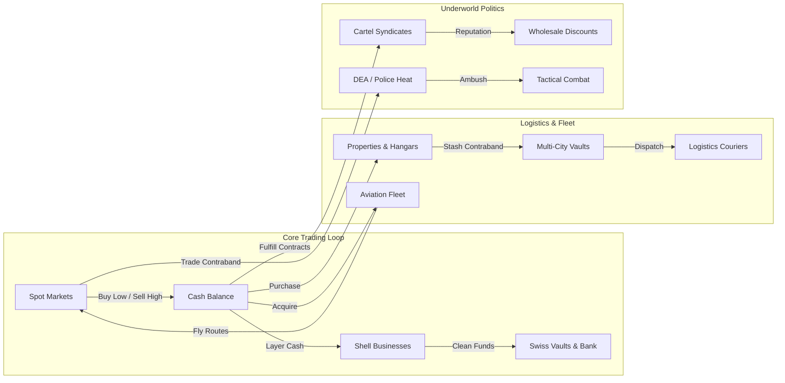

<div align="center">

```
██████╗ ██████╗ ██╗   ██╗ ██████╗     ██╗      ██████╗ ██████╗ ██████╗ 
██╔══██╗██╔══██╗██║   ██║██╔════╝     ██║     ██╔═══██╗██╔══██╗██╔══██╗
██║  ██║██████╔╝██║   ██║██║  ███╗    ██║     ██║   ██║██████╔╝██║  ██║
██║  ██║██╔══██╗██║   ██║██║   ██║    ██║     ██║   ██║██╔══██╗██║  ██║
██████╔╝██║  ██║╚██████╔╝╚██████╔╝    ███████╗╚██████╔╝██║  ██║██████╔╝
╚═════╝ ╚═╝  ╚═╝ ╚═════╝  ╚═════╝     ╚══════╝ ╚═════╝ ╚═╝  ╚═╝╚═════╝ 
                 : : :  R E V A N C E D  : : :
```

# 💊 Drug Lord: ReVanced
### *The Ultimate Underworld Commodity Trading & Cartel Fintech Simulation*

[](https://www.typescriptlang.org/)
[](https://react.dev/)
[](https://vitejs.dev/)
[](https://tailwindcss.com/)
[](https://vitest.dev/)
[](https://vercel.com/)

<p align="center">
  A ground-up modern reimagination of Fred Bulback's legendary Windows shareware classic <b>Drug Lord 2.2 (1999–2003)</b>.<br>
  Elevated with modern narco-aviation, corporate money laundering shell corporations, multi-city safehouse vaults, black market cartel diplomacy, corrupt officials on retainer, federal RICO grand jury wiretaps, an interactive 2D vector world smuggling map with real-time DEA blockade zones, zero-dependency retro Web Audio synthesizer, and high-stakes turn-based tactical combat.
</p>

[🎮 Features](#-key-game-systems) • [⚖️ Evolution vs 2003](#-evolution-drug-lord-22-vs-revanced) • [📦 Commodity Catalog](#-25-commodity-market-catalog) • [🧪 Clandestine Labs](#-clandestine-production--precursor-supply-chains) • [⚖️ Corruption & RICO](#-corruption-informants--federal-rico-engine) • [🗺️ Smuggling Map](#-interactive-world-smuggling-map--geopolitical-radar) • [✈️ Narco-Aviation](#-narco-aviation--private-fleet) • [🧺 Shell Entities](#-underworld-fintech--money-laundering) • [🤝 Syndicates](#-cartel-syndicates--diplomacy) • [👾 Cheat Terminal](#-cartel-debug-terminal--cheat-table) • [🕵️ Cheats Guide](CHEATS.md) • [🎨 Custom Assets](#-custom-asset-directory) • [🚀 Quickstart](#-getting-started)

---

</div>

## ⚖️ Evolution: Drug Lord 2.2 vs. ReVanced

| Feature Area | Classic *Drug Lord 2.2* (1999–2003) | **Drug Lord: ReVanced** (2026) |
| :--- | :--- | :--- |
| **Tech Platform** | Windows 95/98/XP 16/32-bit binary (`.exe`) | Modern Web App (React 19, TypeScript, Tailwind 4, Vite 8) |
| **Commodities** | 10 fixed legacy street drugs | **25 Commodities** (Classics + Fentanyl, Carfentanil, DMT, Compound-Z) |
| **World Locations** | 8 basic text locations | **30 Real-World Global Metropolises** with dynamic flight routes & distance |
| **Navigation & Map** | Static text dropdown list | **Interactive 2D Vector Smuggling Map** with Great-Circle Corridors, DEA Blockades & Animated Blips |
| **Manufacturing** | None (pure broker trading) | **4 Modular Clandestine Labs** + 6 chemical precursors & 30% seaport discounts |
| **Corruption & Law** | Basic cop bribe prompt | **Corrupt Officials on Retainer** + Federal RICO Grand Jury & Extradition Asylum |
| **Aviation System** | None (instant text travel) | **4 Private Aircraft Tiers** with cargo bonus, customs shielding & fuel logistics |
| **Stash Vaults** | Single local locker | **Multi-City Distributed Vaults** + international logistics courier networks |
| **Banking & Finance** | Basic bank interest & loan shark | **8 Corporate Shell Laundering Fronts** + forensic CPAs & Swiss banking stakes |
| **Syndicate Diplomacy** | None | **5 Global Cartel Factions** with standing tiers, peace tributes & contracts |
| **Audio** | PC speaker beeps | **Zero-Dependency Web Audio API Synthesizer** (retro 90s sound fx engine) |
| **Persistence** | Single `.sav` file | Multi-slot Data Vault + **Downloadable Career Dossiers & Hall of Fame** |
| **Debug / Cheats** | Hidden keystrokes | **Interactive Cartel Memory Hex Terminal** (Cheat Engine style memory table) |

---

## 🌟 Key Game Systems



### 📈 1. 21-City Global Commodity Market
* **Dynamic Regional Modifiers**: Real-world geographical economics. Producer cities (Medellín, Bogotá, Bangkok) offer extreme supply discounts; luxury consumer capitals (Zurich, Tokyo, Dubai, London) pay massive markups.
* **Chemical Dossiers**: Inspect any drug to reveal molecular weight, chemical formula, DEA legal schedules, clinical pharmacology, and street aliases.
* **Global Price Radar**: One-click 21-city price arbitrage matrix identifying the most lucrative international smuggling routes.

### ✈️ 2. Narco-Aviation & Private Fleet
Own and fly private smuggling aircraft between international hub airports and clandestine strips:
* **Cessna 208 Caravan Smuggler** — Rugged bush turboprop (+250 cargo, -40% customs risk).
* **Beechcraft King Air 350 ER** — Pressurized twin-turboprop (+600 cargo, -55% customs risk).
* **Bombardier Learjet 75 XR** — High-mach VIP private jet (+1,500 cargo, -70% customs risk).
* **Gulfstream G650ER Sovereign** — Intercontinental flagship (+4,000 cargo, -85% customs risk).
* **Private Aviation Hangar**: Owning a private hangar or sovereign mountain compound provides free kerosene, dropping all jet fuel flight costs to **$0**.

### 🏢 3. Real Estate & Multi-City Stash Network
* **8 Property Tiers**: Expand storage from *Skid Row Tenements* (50 units) to *Fortified Border Ranches* (5,000 units), *Commercial Warehouses* (25,000 units), and *Sovereign Mountain Airfields* (500,000 units).
* **City Stash Vaults**: Store drugs safely in any city to wait out market slumps.
* **Intercontinental Couriers**: Dispatch overland or maritime smuggling couriers to transport contraband between international vaults with calculated travel times and interception risk.

### 🧪 4. Clandestine Production & Precursor Supply Chains
Vertical integration layer allowing players to produce their own contraband:
* **Modular Manufacturing Rooms**: Install specialized labs inside owned properties based on slot limits:
  * **Hydroponic Greenhouse** — Cultivates high-yield Pot & Psilocybin Mushrooms.
  * **Chemical Reflux Lab** — Synthesizes pure Ice (d-Methamphetamine) & Amphetamine Speed.
  * **Pill Pressing Machine** — Presses counterfeit Ecstasy (MDMA) & diverted Oxycodone.
  * **Bio-Reactor Facility** — Advanced biological synthesis of Compound-Z & Carfentanil.
* **Precursor Chemical Logistics**: Purchase 6 industrial precursors (`ephedrine`, `acetic_anhydride`, `pill_binder`, `ergot_solvents`, `bio_precursor_z`, `hydro_nutrients`) from major seaports (e.g. Amsterdam, Singapore, Dubai, Hong Kong, Tokyo) at an automatic **30% maritime shipping discount**.
* **Zero Cost-Basis Profit Margins**: Cook batches over 1 to 5 calendar days, trading storage and hold time for 70% to 85%+ net profit margins over spot market buying.

### ⚖️ 5. Corruption, Informants & Federal RICO Engine
Infiltrate law enforcement, subvert federal surveillance, and evade sealed indictments:
* **Corrupt Officials on Retainer**:
  * **Airport Baggage Handler** ($15,000 upfront, $350/day) — 100% bypass of airport customs inspections and K-9 drug sniffer dogs on commercial flights.
  * **Police Dispatcher** ($35,000 upfront, $750/day) — 24-hour advance tactical raid warnings (`pendingRaidWarning`), -70% DEA ambush danger, and enables guaranteed fleeing (`canFlee: true`).
  * **FinCEN Regulatory Auditor** ($75,000 upfront, $1,500/day) — 100% audit shield on shell laundering fronts, -60% daily RICO meter growth suppression, and -2%/day passive decay.
* **Federal Grand Jury RICO Indictment Meter (0%–100%)**:
  * Driven by high municipal heat (≥70% heat adds +4% to +6%/day), unlaundered millions (> $1M without shell capacity adds +3%/day), and raw deposits (≥ $50k adds +2% to +8%).
  * Decays naturally (-2%/day) in cold heat (<30%) or Sovereign Sanctuaries.
  * Pay off the Lead Prosecutor ($50,000) to knock off -20% from the meter.
  * **100% Indictment Asset Freeze**: Sealed indictment freezes all bank accounts (`isBankFrozen: true`), blocking all deposits and withdrawals until quashed.
* **Emergency Sovereign Extradition Escape Flights**:
  * Charter emergency flights to Non-Extradition Sanctuaries (*Dubai, Panama City, Zurich, Singapore, Istanbul*) or owned sovereign airfields.
  * Asylum quashes the federal warrant, resets RICO meter to 10%, unfreezes bank accounts (levying a 15% DOJ forfeiture penalty), and logs an extradition escape.

### 🗺️ 6. Interactive World Smuggling Map & Geopolitical Radar
Replaces text-based location menus with an interactive command center:
* **2D Vector World Map Engine**:
  * Equirectangular projection mapping 30 global metropolises onto real-world latitude/longitude coordinates.
  * High-fidelity SVG continent vectors, equator/tropics/meridian grid lines, and retro CRT radar sweeps.
* **Great-Circle Geodesic Flight Corridors**:
  * Dynamically renders curved SVG laser paths with calculated nautical mile distances (`NM`) and direct airline connection lanes.
* **Real-Time DEA Naval & Aerial Blockade Zones**:
  * Visual hazard cordons with striped radar fills: *Operation Caribbean Shield (JIATF-S)*, *Eastern Pacific Narco-Sub Vector*, *Frontex Mediterranean Gateway*, and *ASEAN Airborne Grid*.
* **Live In-Transit Courier Fleet Blips**:
  * Active safehouse vault shipments (`player.shipments`) travel visibly across maritime and overland corridors with real-time cargo tooltips.
* **Animated Flight Traversal & Cockpit HUD**:
  * Jet traversal animation along the great-circle curve with real-time Mach, groundspeed, altitude, and customs security telemetry before landing.
* **Dynamic Geopolitical Hotspots**:
  * Automated radar alerts for dockworker port strikes, cartel syndicate turf disputes, high-heat border crackdowns, and K-9 interdiction units.

### 🧺 7. Underworld Fintech & Money Laundering
Avoid FinCEN asset forfeiture by structuring and layering illicit street profits:
* **8 Shell Business Fronts**: Coin Laundromats, Express Car Washes, VIP Nightclubs, Fine Art Galleries, Customs Brokerages, Panama Bearer Holding Trusts, ASIC Crypto Mining Pools, and Swiss Private Banking Subsidiaries.
* **Corporate Legal Upgrades**: Retain forensic CPAs, offshore defense attorneys, and automated micro-smurfing mule networks to suppress audit risks.

### 🤝 8. Cartel Syndicates & Black Market Diplomacy
Manage diplomatic relations with 5 international crime syndicates:
* **Medellín Cartel** (*Los Extraditables*) — Cocaine & Crack Cocaine
* **Golden Triangle Triads** (*The Black Lotus Triad*) — Raw Opium & Refined Heroin
* **Synthetic Chem Guild** (*Apex Synthetics*) — Ice, Fentanyl, Tranq & Ketamine
* **European Designer Ring** (*Euro-Nightlife*) — Pure MDMA, Liquid LSD & MDA
* **Balkan Smugglers Consortium** (*The Iron Adriatic*) — Speed, Kat, Hashish & Weapons
* **Reputation Tiers**: Advance from *Nemesis* and *Hostile* up to *Associate* and *Allied Don* for up to **30% wholesale commodity discounts**.
* **Peace Tributes**: Wire tribute cash to cartel bosses to call off hit squads.
* **Supply Contracts**: Deliver required contraband parcels to target cities within strict deadlines for massive cash bonuses and syndicate standing.

### ⚔️ 9. Tactical Turn-Based Combat
Encounter local street cops, DEA federal task forces, tactical SWAT squads, and armed loan shark enforcers.
* **Weapons**: Combat Knives, 9mm Pistols, 12-Gauge Shotguns, SMGs, Dynamite, Hand Grenades, Flamethrowers, and Anti-SWAT Rocket Launchers.
* **Tactical Gear**: M84 Stun Flashbangs (forces enemy miss), Tactical Smoke Screens (+50% escape probability), Military Combat Medkits (+40 HP), and No-Scent Chemical Sprays (masks cargo from airport sniffer dogs).

### 👑 10. Dealer Hierarchy & Demotion Radar
* Rise through 6 underworld standing ranks: **Wannabe ➔ Small-time Operator ➔ Dealer ➔ Big-Time Dealer ➔ Distributor ➔ Drug Lord**.
* **Live Solvency Checker**: Hover the dealer badge to track promotion requirements and 3-day hold milestones. If your net worth drops below the rank threshold, a 3-day insolvency timer warns you before stripping status.

### 💾 11. Hall of Fame & Career Dossiers
* **Data Vault**: Multi-slot browser local storage persistence with JSON import/export.
* **Hall of Fame**: Persistent leaderboard archiving your greatest criminal empires with shareable career dossiers and score calculations.
* **Endless Mode**: Play fixed 30, 60, 90-day campaigns, or rule the world indefinitely.

---

## 📦 25-Commodity Market Catalog

| Commodity | Scientific / Chemical Formula | Base Price | Market Volatility | Primary Smuggling Hubs |
| :--- | :--- | :---: | :---: | :--- |
| **Cocaine** | $C_{17}H_{21}NO_4$ (Benzoylmethylecgonine) | $22,000 | ±35% | Medellín, Bogotá ➔ Miami, New York |
| **Compound-Z** | $C_{32}H_{48}N_6O_4$ (Synthetic Combat Stimulant) | $16,500 | ±40% | Berlin, Zurich ➔ Tokyo, London |
| **Heroin** | $C_{21}H_{23}NO_5$ (Diacetylmorphine) | $9,000 | ±30% | Bangkok, Hong Kong ➔ Frankfurt, London |
| **Carfentanil** | $C_{24}H_{30}N_2O_3$ (Wildnil) | $4,800 | ±45% | Tijuana, Mexico City ➔ Detroit, Chicago |
| **Crack** | $C_{17}H_{21}NO_4$ (Freebase Cocaine) | $2,400 | ±35% | Miami, Los Angeles ➔ Atlanta, New York |
| **Ice** | $C_{10}H_{15}N$ (d-Methamphetamine HCl) | $1,800 | ±25% | Tijuana, Phoenix ➔ Sydney, Tokyo |
| **PCP** | $C_{17}H_{25}N$ (Phencyclidine) | $1,100 | ±25% | Los Angeles, San Francisco ➔ New York |
| **Opium** | $C_{17}H_{19}NO_3$ (Papaver Somniferum) | $800 | ±20% | Bangkok, Istanbul ➔ Marseille, Zurich |
| **Hashish** | $C_{21}H_{30}O_2$ (Cannabis Sativa Resin) | $750 | ±20% | Casablanca, Istanbul ➔ Amsterdam, Paris |
| **Krokodil** | $C_{17}H_{21}NO_2$ (Desomorphine) | $650 | ±35% | Moscow, Kyiv ➔ Berlin, Warsaw |
| **DMT** | $C_{12}H_{16}N_2$ (The Spirit Molecule) | $580 | ±35% | Rio de Janeiro, Lima ➔ San Francisco, Ibiza |
| **Oxycodone** | $C_{18}H_{21}NO_4$ (Diverted Oxy 80) | $380 | ±32% | Miami, Detroit ➔ Boston, Philadelphia |
| **LSD** | $C_{20}H_{25}N_3O$ (Lysergic Acid Diethylamide) | $320 | ±30% | Amsterdam, San Francisco ➔ London, Berlin |
| **Morphine** | $C_{17}H_{19}NO_3$ (Morphine Sulfate M 15) | $260 | ±25% | London, Frankfurt ➔ Vienna, Prague |
| **Peyote** | $C_{11}H_{17}NO_3$ (Mescaline Buttons) | $220 | ±20% | Mexico City, Phoenix ➔ Denver, Austin |
| **Fentanyl** | $C_{22}H_{28}N_2O$ (Synthetic Cut) | $180 | ±38% | Tijuana, Vancouver ➔ Philadelphia, Baltimore |
| **Codeine** | $C_{18}H_{21}NO_3$ (Promethazine Cough Syrup) | $160 | ±28% | Houston, Atlanta ➔ Los Angeles, Miami |
| **Speed** | $C_9H_{13}N$ (dl-Amphetamine Sulfate) | $150 | ±25% | Frankfurt, Warsaw ➔ London, Amsterdam |
| **Tranq** | $C_{12}H_{16}N_2S$ (Xylazine Hydrochloride) | $140 | ±30% | Philadelphia, Baltimore ➔ Newark, Boston |
| **MDA** | $C_{10}H_{13}NO_2$ (Tenamfetamine) | $110 | ±25% | Ibiza, Amsterdam ➔ Berlin, Miami |
| **Mushrooms** | $C_{12}H_{17}N_2O_4P$ (Psilocybin) | $90 | ±20% | Seattle, Vancouver ➔ Denver, Portland |
| **Pot** | $C_{21}H_{30}O_2$ (Cannabis Sativa Flower) | $60 | ±20% | Los Angeles, Denver ➔ Worldwide |
| **Special K** | $C_{13}H_{16}ClNO$ (Ketamine HCl) | $55 | ±25% | London, Manchester ➔ Ibiza, Berlin |
| **Ecstasy** | $C_{11}H_{15}NO_2$ (MDMA Party Tablets) | $45 | ±30% | Amsterdam, Brussels ➔ London, Ibiza |
| **Kat** | $C_9H_{11}NO$ (S-Cathinone Leaves) | $12 | ±20% | Nairobi, Addis Ababa ➔ London, Dubai |

---

## 👾 Cartel Debug Terminal & Cheat Table

Press **`~`** (tilde), press **`Ctrl + Shift + D`**, or click the **`[>_]` Terminal** button in the dashboard header to open the Cartel Debug Terminal and Cheat Engine memory inspector.

> [!TIP]
> For the comprehensive guide with all 25 drug IDs, 30 city IDs, syntax breakdown, Cheat Engine table download, and browser console API, see **[🕵️ CHEATS.md](CHEATS.md)**.

### Static 4-Byte Memory Offset Map
The live state is mapped to an internal 32-bit linear memory mirror:
```
[Offset]     [Type]       [Description]                          [Live Sync]
+0x00        4-Byte Int   Player Liquid Cash                     Auto-synced every 250ms
+0x04        4-Byte Int   Swiss Bank Account Balance             Auto-synced every 250ms
+0x08        4-Byte Int   Loan Shark Principal Debt              Auto-synced every 250ms
+0x0C        4-Byte Int   Player Health (0-100 HP)               Auto-synced every 250ms
+0x10        4-Byte Int   Current Game Day                       Auto-synced every 250ms
+0x14        4-Byte Int   Max Campaign Days                      Auto-synced every 250ms
+0x18        4-Byte Int   Cartel God Mode Flag (1=On, 0=Off)     Auto-synced every 250ms
+0x1C        4-Byte Int   Extra Stash Carrying Capacity          Auto-synced every 250ms
```

### Essential Cheat Commands
* `cash <val>` / `cash +<val>` — Set or inject liquid cash.
* `bank <val>` / `bank +<val>` — Set or wire funds to offshore bank.
* `debt 0` / `clear_debt` — Wipe all loan shark debts immediately.
* `heal` / `health <1-100>` — Restore health to 100% HP.
* `god` — Toggle Cartel God Mode (invulnerability + 100% flee success).
* `capacity <val>` — Add extra pocket carrying capacity units.
* `teleport <city_id>` — Instant transit to any of the 30 world cities (e.g. `teleport bogota`).
* `rig <drug_id> <price>` — Rig the local street price of any commodity (e.g. `rig cocaine 50000`).
* `vault_give <city_id> <drug_id> <qty>` — Stash contraband directly in safehouse vaults.
* `noscent <count>` — Spawn DEA K-9 No-Scent masking spray cans.
* `rico <0-100>` — Set Federal Grand Jury RICO Indictment Meter percentage (100 = bank freeze).
* `corrupt <official_id>` — Put corrupt official on retainer (`airport_baggage_handler`, `police_dispatcher`, `fincen_auditor`).
* `escape <sanctuary_id>` — Emergency extradition flight to sovereign haven (`dubai`, `panama_city`, `zurich`, `singapore`, `istanbul`).
* `hotspots` — Inspect active geopolitical smuggling hotspots (port strikes, cartel turf wars, border lockdowns).
* `blockade <city_id>` — Trigger tactical DEA / SWAT blockade cordon and raid alert on target city.
* `wire` — Intercept upcoming market surge intel and police wiretaps.
* `sfx <name>` — Test retro Web Audio sound synthesis (e.g. `sfx pager`).

👉 **Read the full [Cheats & Drug ID Guide (CHEATS.md)](CHEATS.md)** for complete tables and copy-pasteable scripts.

---

## 🎨 Custom Asset Directory

The engine features responsive SVG fallbacks for every commodity, weapon, property, plane, shell company, and syndicate. Drop square `.png` files into `public/assets/` to instantly replace the artwork:

```
public/assets/
├── drugs/         # 25 files: cocaine.png, carfentanil.png, dmt.png, etc.
├── weapons/       # 15 files: pistol.png, shotgun.png, bullet_proof_vest.png, etc.
├── properties/    # 8 files:  skid_row_shack.png, private_hangar.png, etc.
├── aircraft/      # 4 files:  cessna_smuggler.png, gulfstream_g650.png, etc.
├── shells/        # 8 files:  laundromat.png, nightclub.png, crypto_farm.png, etc.
├── sharks/        # 5 files:  buddles.png, laughing_max.png, etc.
├── syndicates/    # 5 files:  medellin.png, golden_triangle.png, etc.
└── ranks/         # 6 files:  wannabe.png, dealer.png, drug_lord.png, etc.
```

---

## 🕹️ Keyboard Shortcuts

| Key | Action |
| :---: | :--- |
| **`~`** / **``` ` ```** | Toggle Cartel Debug Terminal (Cheat Console) |
| **`Esc`** | Close active inspection popover, modal, or market dossier |
| **`M`** | Toggle Interactive Tactical Smuggling Map & Flight Network |
| **`B`** | Quick Buy modal for selected commodity |
| **`S`** | Quick Sell modal for selected commodity |
| **`T`** | Open Aviation & Travel Flight Network |

---

## 🚀 Getting Started

### Prerequisites
* **Node.js** v18.0 or newer
* **npm** v9.0 or newer

### Installation
```bash
# 1. Clone the repository
git clone https://github.com/danz-the-penguin/druglord-revanced.git
cd druglord-revanced

# 2. Install dependencies
npm install

# 3. Start local development server
npm run dev
```
Open **[http://localhost:5173](http://localhost:5173)** in your browser.

### Test Suites
Run the comprehensive 153-test engine test suite:
```bash
npm test
```

### Production Build
```bash
npm run build
npm run preview
```

---

## 🌐 Deployment to Vercel

The project includes pre-configured SPA routing via [`vercel.json`](vercel.json).

### Option 1: Vercel CLI (Instant)
```bash
npm i -g vercel
vercel --prod
```

### Option 2: Continuous Deployment via GitHub
1. Navigate to **[vercel.com/new](https://vercel.com/new)**.
2. Select and import **`danz-the-penguin/druglord-revanced`**.
3. Vercel automatically detects the **Vite** preset (`npm run build` ➔ `dist`).
4. Click **Deploy**. Every subsequent `git push` to `master` will trigger a live production build.

---

## 📜 Credits & Acknowledgments

* **Original Game Concept & Design**: **Fred Bulback** (1999–2003), creator of the original Windows shareware game *Drug Lord 2.2*.
* **ReVanced Edition Engineering**: Modernized, redesigned, and maintained by **[danz-the-penguin](https://github.com/danz-the-penguin)**.
* Dedicated to the vibrant history of classic BBS, MS-DOS, and early Windows simulation gaming.

---

<div align="center">
  <sub><b>Disclaimer:</b> <i>Drug Lord: ReVanced</i> is a satirical economic simulation and strategic work of fiction. It is intended solely for entertainment purposes and does not advocate, endorse, or promote illegal drug trade or illicit activities.</sub>
</div>
