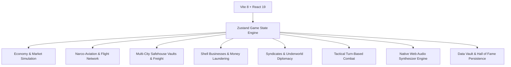

# 💊 Drug Lord: ReVanced

> **The Modern Retro Underworld Commodity Trading & Cartel Syndicate Simulation.**  
> *A spiritual successor and modern fintech reimagination of Fred Bulback's classic Windows shareware masterpiece, Drug Lord 2.2 (1999–2003).*

[](https://www.typescriptlang.org/)
[](https://react.dev/)
[](https://vitejs.dev/)
[](https://tailwindcss.com/)
[](https://vitest.dev/)
[](#credits--acknowledgments)

---

## 📖 Overview

**Drug Lord: ReVanced** brings the iconic 90s/00s drug-trading simulation into the modern world with cutting-edge underworld fintech, narco-aviation flight networks, corporate money laundering fronts, intercontinental stash vaults, and black market syndicate diplomacy.

Built with **React 19**, **TypeScript**, **Zustand**, and **Tailwind CSS 4**, *Drug Lord: ReVanced* pairs deep economic simulation and high-stakes turn-based encounters with zero-dependency native Web Audio synthesizers and high-contrast retro aesthetics.

---

## 🌟 Key Features

### 📈 1. Global Dynamic Economy & 25 Modern Commodities
Trade across **21 real-world international cities** (from Medellín and Miami to Amsterdam, Tokyo, Zurich, and Hong Kong) with localized pricing algorithms, supply/demand volatility spikes, and DEA heat tracking.
* **25 Total Commodities**: Includes classics (*Cocaine, Heroin, Opium, PCP, Hashish, LSD*) alongside modern pharmaceuticals and synthetic combat stimulants (*Carfentanil, DMT, Compound-Z, Oxycodone, Codeine Syrup, Tranq*).
* **Chemical & Pharmacological Dossiers**: Detailed schedules, molecular formulas, street aliases, and regional price multipliers.
* **Commodity Price History & Radar**: Built-in SVG price charts and 21-city international market arbitrage radar.

### ✈️ 2. Narco-Aviation & Airport Flight Network
* **Private Fleet**: Acquire private aircraft from bush turboprops to sovereign intercontinental business jets:
  - *Cessna 208 Caravan Turbo-Smuggler* (+250 Cargo, -40% Customs Risk)
  - *Beechcraft King Air 350 Twin-Turboprop* (+600 Cargo, -55% Customs Risk)
  - *Bombardier Learjet 75 XR Sub-Rosa* (+1,500 Cargo, -70% Customs Risk)
  - *Gulfstream G650ER Sovereign Kingpin* (+4,000 Cargo, -85% Customs Risk)
* **Real Flight Schedules**: Fly between domestic and international hub airports or clandestine airstrips.
* **Complimentary Kerosene**: Owning a private aviation hangar or sovereign mountain airstrip reduces all aircraft jet fuel costs to **$0**.

### 🏢 3. Real Estate & Multi-City Stash Vaults
* **8 Property Tiers**: Expand permanent carrying capacity and lower city police heat from Skid Row Tenements (+50 units) to Sovereign Mountain Airfield Compounds (+500,000 units).
* **Distributed City Vaults**: Deposit excess contraband in safehouse vaults across any unlocked world city.
* **Underworld Logistics Couriers**: Dispatch overland or maritime couriers to ship stashed contraband across international borders with real transit days and interception risk calculations.

### 🧺 4. Underworld Fintech & Money Laundering Fronts
* **8 Shell Corporation Tiers**: Layer dirty street cash into clean, audit-shielded bank deposits:
  - *Coin Laundromats & Car Washes* (Starter cash fronts)
  - *VIP Nightclubs & Art Galleries* (High-volume nightlife & appraisal layering)
  - *Freight Logistics Brokerages* (Grants -30% customs risk on international flights)
  - *Panama Nominee Holding Trusts & Crypto ASIC Mining Pools* (Offshore secrecy)
  - *Swiss Private Banking Subsidiaries* (1% fee rate and complete immunity to federal tax audits)
* **Corporate Legal Retainers**: Retain forensic CPAs, offshore defense counsel, and automated micro-smurfing mule rings.

### 🤝 5. Cartel Syndicates & Black Market Diplomacy
Interact with 5 major global crime syndicates:
* **Medellín Cartel** (*Los Extraditables*) — Cocaine & Crack
* **Golden Triangle Triads** (*The Black Lotus Triad*) — Raw Opium & Refined Heroin
* **Synthetic Chem Guild** (*Apex Synthetics*) — Ice, Fentanyl, Tranq & Ketamine
* **European Designer Ring** (*Euro-Nightlife*) — Pure MDMA, Liquid LSD & MDA
* **Balkan Smugglers Consortium** (*The Iron Adriatic Network*) — Speed, Kat & Military Ordnance
* **Diplomatic Standings**: Advance through 5 standing tiers (*Nemesis, Hostile, Neutral, Associate, Allied Don*) to unlock up to 30% wholesale discounts or pay peace tributes to call off hit squads.
* **Smuggling Contracts**: Accept time-sensitive cross-border supply runs for massive cash bounties and reputation boosts.

### 👑 6. Underworld Hierarchy & Insolvency Checker
Progress from street-level **Wannabe** up to untouchable **Drug Lord**:
* **Live Net Worth Progression**: Dynamic tracking of net worth requirements and 3-day capital hold checks.
* **Insolvency Demotion Alert**: Automatic warning system if net worth falls below rank requirements, with a 3-day countdown before demotion.

### ⚔️ 7. Tactical Combat & Armory
Turn-based combat encounters against local beat police, DEA tactical units, SWAT squads, and loan shark enforcers.
* **Weapons**: Combat Knives, 9mm Pistols, 12-Gauge Shotguns, SMGs, Dynamite, Fragmentation Grenades, Flamethrowers, and Rocket Launchers.
* **Armor**: Heavy Leather Coats, Bulletproof Kevlar Vests, and experimental Energy Globes.
* **Tactical Gear**: M84 Flashbangs (blinds enemies), Tactical Smoke Screens (+50% escape probability), Military Medkits (+40 HP), and No-Scent Sprays (masks cargo from airport sniffer dogs).

### 💾 8. Persistence, Hall of Fame & Career Dossiers
* **Data Vault**: Multi-slot local persistence with auto-save, manual export, and import.
* **Hall of Fame**: Persistent leaderboard celebrating your greatest kingpin careers with downloadable dossiers.
* **Endless Mode**: Play 30-day, 60-day, 90-day campaigns, or rule the world indefinitely.

### 👾 9. Cartel Debug Terminal (Cheat Table)
* Built-in retro Cheat Engine-style memory inspector and command terminal (toggle via the `~` key or header button).
* Supports instant memory editing and classic codes: `hesoyam`, `god`, `teleport <city>`, `give <drug> <qty>`, `clear_heat`, `rep <syndicate> <val>`, and more.

### 🔊 10. Zero-Dependency Retro Web Audio Synthesizer
* Native Web Audio API synthesizer synthesizing authentic 90s PC sound effects (coin chimes, 8-bit gunshots, airport flight announcements, police sirens, pager alerts, cash registers).

---

## 🎨 Asset Directory & Custom Artwork

The game includes fully responsive SVG fallbacks for every entity. You can drop custom `.png` images into `public/assets/` to immediately customize the visuals without code changes:

| Category | Target Directory | Recommended Dimensions | Format | Total Assets |
| :--- | :--- | :--- | :--- | :--- |
| **Drugs** | `public/assets/drugs/` | 256×256 or 512×512 | PNG (transparent) | 25 |
| **Weapons & Armor** | `public/assets/weapons/` | 256×256 or 512×512 | PNG (transparent) | 15 |
| **Properties** | `public/assets/properties/` | 800×450 (16:9) | PNG / JPG | 8 |
| **Aircraft** | `public/assets/aircraft/` | 800×450 (16:9) | PNG / JPG | 4 |
| **Shell Businesses** | `public/assets/shells/` | 256×256 or 512×512 | PNG (transparent) | 8 |
| **Loan Sharks** | `public/assets/sharks/` | 256×256 or 512×512 | PNG (portrait) | 5 |
| **Syndicates** | `public/assets/syndicates/` | 256×256 or 512×512 | PNG (seal/logo) | 5 |
| **Dealer Ranks** | `public/assets/ranks/` | 256×256 or 512×512 | PNG (crest) | 6 |

---

## 🛠️ Tech Stack & Architecture



* **Frontend**: React 19, TypeScript, Tailwind CSS 4, Lucide React Icons
* **State Management**: Zustand 5 with immutable state transitions
* **Audio Engine**: 100% dependency-free HTML5 Web Audio API synth
* **Testing**: Vitest (88/88 unit tests across 10 engine test suites)
* **Build System**: Vite 8 + Rolldown/esbuild

---

## 🚀 Getting Started

### Prerequisites
* [Node.js](https://nodejs.org/) (v18.0 or newer)
* [npm](https://www.npmjs.com/) (v9.0 or newer)

### Installation

1. **Clone the repository**:
   ```bash
   git clone https://github.com/danz-the-penguin/druglord-revanced.git
   cd druglord-revanced
   ```

2. **Install dependencies**:
   ```bash
   npm install
   ```

3. **Start the local development server**:
   ```bash
   npm run dev
   ```
   *Open [http://localhost:5173](http://localhost:5173) in your browser.*

4. **Run test suites**:
   ```bash
   npm test
   ```

5. **Build for production**:
   ```bash
   npm run build
   ```

---

## 🌐 Deployment

### Deploy to Vercel (Recommended)

This repository includes a preconfigured `vercel.json` with SPA routing rules.

#### Method 1: Using the Vercel CLI
```bash
npm i -g vercel   # If not already installed
vercel --prod
```

#### Method 2: Git Integration via Vercel Dashboard
1. Go to [vercel.com/new](https://vercel.com/new).
2. Import the `danz-the-penguin/druglord-revanced` repository.
3. Framework preset will automatically detect **Vite**.
4. Click **Deploy**. Vercel will build and deploy automatically on every `git push`.

---

## 🕹️ Keyboard Shortcuts

| Shortcut | Action |
| :--- | :--- |
| `~` / `` ` `` | Toggle Cartel Debug Terminal (Cheat Console) |
| `Esc` | Close open modal or dossier |
| `B` | Quick Buy modal for selected commodity |
| `S` | Quick Sell modal for selected commodity |
| `T` | Open Flight & Travel Network |

---

## 📜 Credits & Acknowledgments

* **Original Game Concept & Design**: **Fred Bulback** (1999–2003) — creator of the classic Windows shareware game *Drug Lord 2.2*.
* **ReVanced Edition Design & Engineering**: Modernized, expanded, and maintained by **danz-the-penguin**.
* Dedicated to all classic BBS, DOS, and Windows simulation gamers.

---

<div align="center">
  <sub>Drug Lord: ReVanced is a fictional satire and economic simulation game. It does not endorse or promote illegal activities.</sub>
</div>
